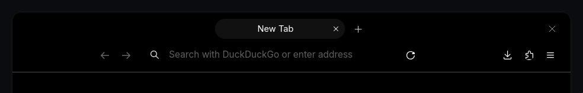

# Modern restyle of Firefox's topbar.



## Installation

1. Locate Firefox's **Profile directory** by going to `about:support`. The path will be under the **Profile directory** row.

2. `cd` into Firefox's **Profile directory** and clone the repository into the `chrome` directory.

```bash
git clone https://github.com/dquevid/firefox-custom-theme.git chrome
```
3. Restart Firefox.

This configuration doesn't affect Firefox's colorscheme, so it is fully compatible with your favourite themes. For a fitting dark theme i recommend [Just Right OLED Dark](https://addons.mozilla.org/en-US/firefox/addon/just-right-oled-dark/).

## ⚠️ WARNING ⚠️

This configuration changes the `.titlebar-buttonbox-container` position property to `absolute`. Tbis may cause overlaps with other elements in the topbar. With Firefox's default configuration, it'll overlap with `List all tabs` button.

Remove all overlapping buttons from topbar using `Customize toolbar` option in topbar's context menu.
